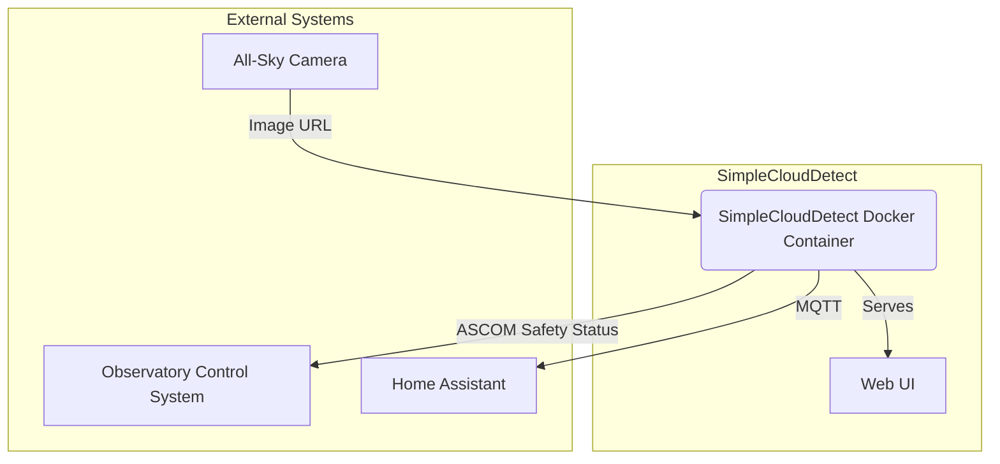
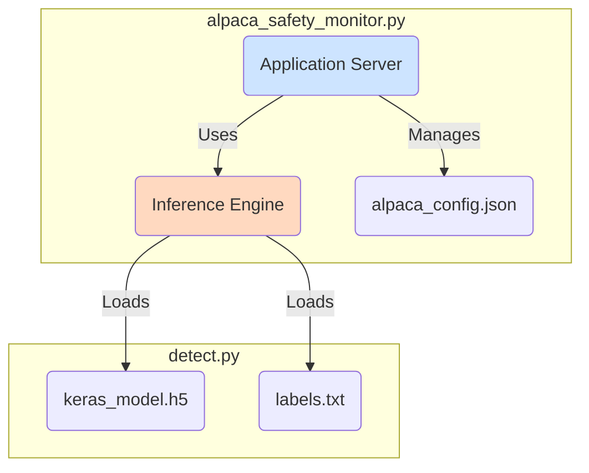
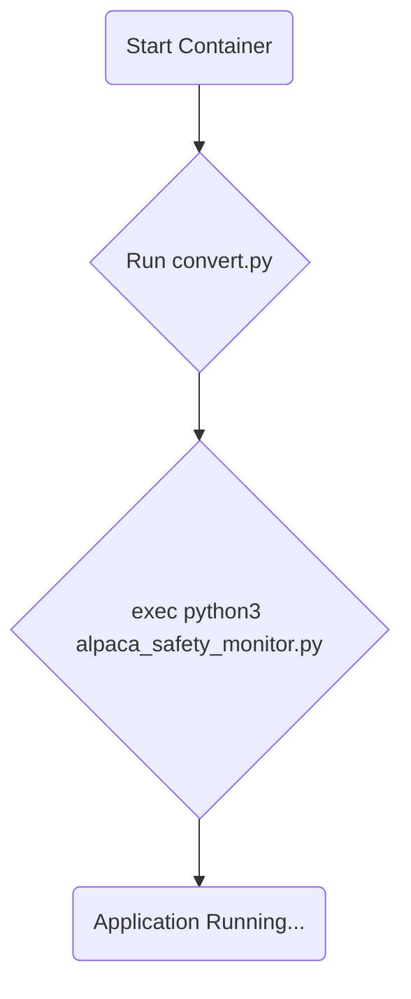
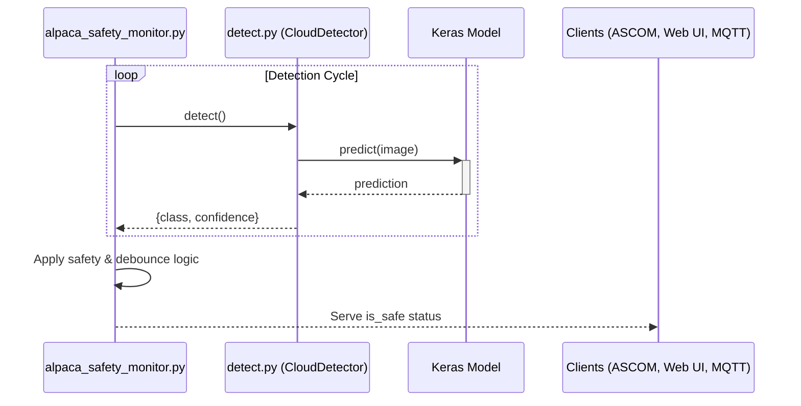

# SimpleCloudDetect Architecture

## 1. Overview

SimpleCloudDetect is a standalone application designed to determine local sky conditions for astronomical purposes. It uses a machine learning model to classify images from an all-sky camera and determines if the conditions are "safe" for operating an observatory.

The system is exposed as an ASCOM Alpaca SafetyMonitor, which is a standard interface for observatory safety equipment. It provides a web-based user interface for configuration and status monitoring, and can publish its findings to an MQTT broker for integration with other systems like Home Assistant.

The application is designed to be deployed as a Docker container and supports both `amd64` and `arm64` architectures, allowing it to run on standard servers or single-board computers like a Raspberry Pi.

## 2. Core Components

The architecture is composed of two primary Python scripts and a set of configuration and model files.

### 2.1. `detect.py`: The Inference Engine

This script is the core of the cloud detection functionality.

- **Responsibilities**:
  - **Model Loading**: Loads a pre-trained Keras model (`keras_model.h5`) and the corresponding class labels (`labels.txt`).
  - **Image Acquisition**: Fetches an image from a specified URL (via the `IMAGE_URL` environment variable). This can be a web URL (`http://`) or a local file path (`file://`).
  - **Image Processing**: Prepares the image for the model by resizing it to 224x224 pixels and normalizing its values.
  - **Prediction**: Performs inference using the loaded model to classify the image into one of six categories: `Clear`, `Mostly Cloudy`, `Overcast`, `Rain`, `Snow`, or `Wisps of clouds`.
  - **MQTT Publishing**: Publishes the raw detection result (class name, confidence score, and detection time) to a configured MQTT broker. It supports a legacy mode (single JSON topic) and a Home Assistant discovery mode, which automatically creates and updates sensors in Home Assistant.

### 2.2. `alpaca_safety_monitor.py`: The Application Server

This script wraps the core inference engine into a full-featured application, acting as the main entry point.

- **Responsibilities**:
  - **ASCOM Alpaca Server**: Implements a standard ASCOM Alpaca SafetyMonitor device using the `Flask` web framework. This exposes a REST API that allows observatory control software to query the safety status. The primary endpoint is `GET /api/v1/safetymonitor/{device_number}/issafe`.
  - **Web User Interface**: Provides a comprehensive web UI accessible at `/setup/v1/safetymonitor/{device_number}/setup`. This "Command Center" allows users to:
    - View the current safety status, latest detection image, and confidence score.
    - Configure all operational parameters.
    - View a history of safety state transitions.
  - **Background Processing**: It instantiates the `CloudDetector` from `detect.py` and runs the detection process in a continuous background thread.
  - **Safety Logic**: It applies a layer of business logic on top of the raw model prediction to determine the final `is_safe` state. This logic is user-configurable and includes:
    - **Unsafe Conditions**: A list of weather classifications that are considered unsafe (e.g., `Rain`, `Overcast`).
    - **Confidence Thresholds**: A minimum confidence percentage the model must have for a classification to be considered valid. This can be set per-class.
    - **Debouncing**: Configurable wait times before changing state. For example, it can be set to wait 5 minutes after conditions become clear before reporting "Safe", preventing rapid cycling during intermittent cloud cover.
  - **Configuration Management**: Manages its own configuration via an `alpaca_config.json` file.

## 3. Deployment and Execution

The application is intended to be run as a Docker container.

### 3.1. `Dockerfile`

The `Dockerfile` defines the container image.

- It uses a multi-stage build to create a slim final image.
- It installs all Python dependencies from `requirements.txt` (or `requirements-arm64.txt` for ARM systems). Key dependencies include `tensorflow-cpu`, `keras`, `flask`, `paho-mqtt`, and `pillow`.
- It sets up a non-root user for enhanced security.
- The container's entrypoint is the `start_services.sh` script.
- It includes a `HEALTHCHECK` directive that periodically queries an API endpoint to ensure the application is responsive. If the health check fails, the container is automatically restarted.

### 3.2. `start_services.sh`

This shell script is executed when the container starts.

1.  It first runs `convert.py`, which ensures the ML model is in the correct format.
2.  It then uses `exec` to launch the `alpaca_safety_monitor.py` script. Using `exec` makes the Python application the main process in the container, which allows it to handle system signals correctly for graceful shutdown.

## 4. Data Flow

The typical data flow for a single detection cycle is as follows:

1.  The background detection loop in `alpaca_safety_monitor.py` is triggered by its timer.
2.  It calls the `detect()` method on the `CloudDetector` instance.
3.  `CloudDetector` fetches the image from the `IMAGE_URL`.
4.  The image is pre-processed and passed to the Keras model for inference.
5.  The model returns a prediction (e.g., `class_name: "Clear"`, `confidence_score: 98.5`).
6.  This result is passed back to `alpaca_safety_monitor.py`.
7.  The safety logic engine evaluates this result against the user-defined rules (unsafe conditions, confidence thresholds, and debouncing timers).
8.  The final, stable `is_safe` state (either `true` or `false`) is cached.
9.  This state is then available to be served to clients via the ASCOM API, the web UI, and is also published to MQTT.
