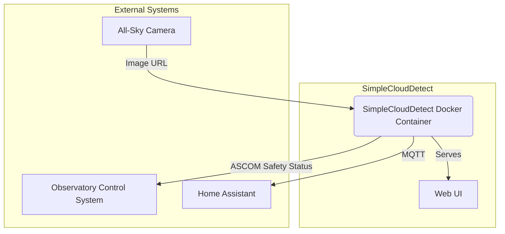
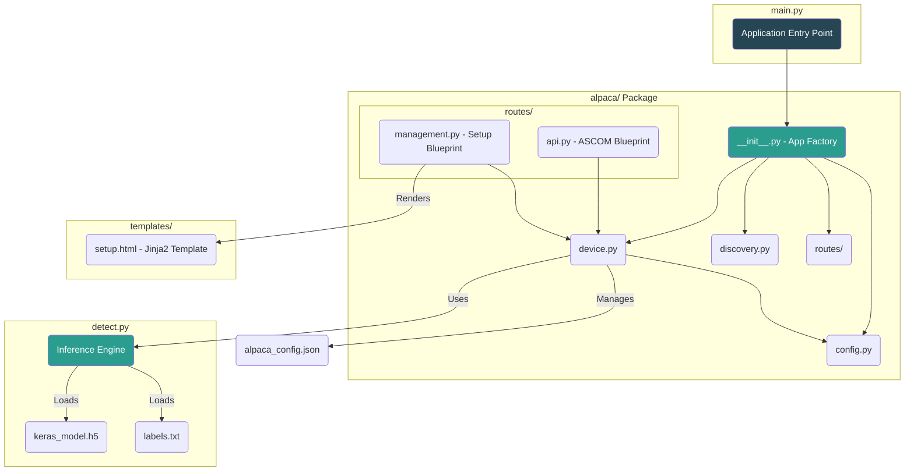
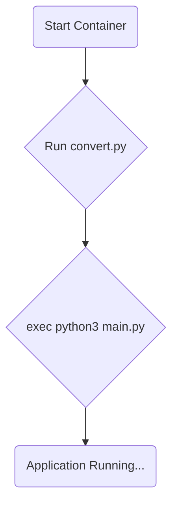
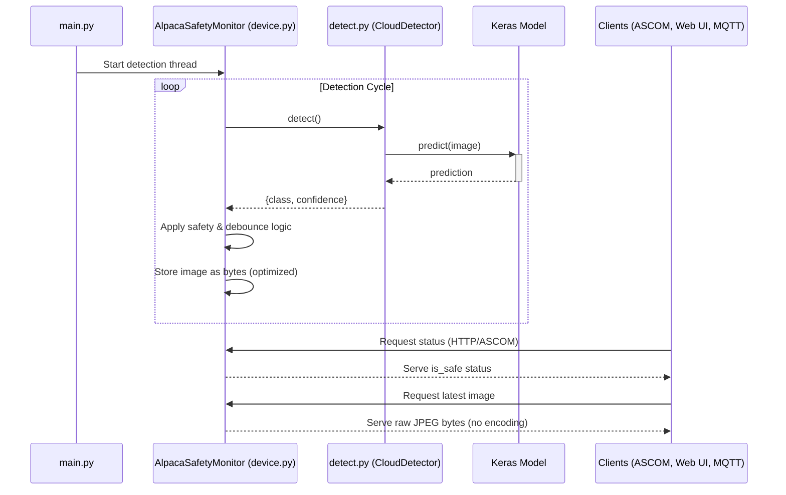

# SimpleCloudDetect Architecture

## 1. Overview

SimpleCloudDetect is a standalone application designed to determine local sky conditions. It uses a machine learning model to classify images from an all-sky camera and determines if the conditions are "safe" for operating an observatory.

The system is exposed as an ASCOM Alpaca SafetyMonitor. It provides a web-based user interface for configuration and status monitoring, and can publish its findings to an MQTT broker for integration with other systems like Home Assistant.

The application is designed to be deployed as a Docker container and supports both `amd64` and `arm64` architectures, allowing it to run on standard x86 servers or single-board computers like a Raspberry Pi.

## 2. Core Components

The architecture follows a modular package design with clear separation of concerns.

### 2.1. `detect.py`: The Inference Engine

This script is the core of the cloud detection functionality.

- **Responsibilities**:
  - **Model Loading**: Loads a pre-trained Keras model (`keras_model.h5`) and the corresponding class labels (`labels.txt`).
  - **Image Acquisition**: Fetches an image from a specified URL (via the `IMAGE_URL` environment variable). This can be a web URL (`http://`) or a local file path (`file://`).
  - **Image Processing**: Prepares the image for the model by resizing it to 224x224 pixels and normalizing its values.
  - **Prediction**: Performs inference using the loaded model to classify the image into one of six categories: `Clear`, `Mostly Cloudy`, `Overcast`, `Rain`, `Snow`, or `Wisps of clouds`.
  - **MQTT Publishing**: Publishes the raw detection result (class name, confidence score, and detection time) to a configured MQTT broker. It supports a legacy mode (single JSON topic) and a Home Assistant discovery mode, which automatically creates and updates sensors in Home Assistant.

### 2.2. `alpaca/` Package: Modular Application Components

The application is organized as a Python package with clear separation of concerns:

#### 2.2.1. `alpaca/config.py`: Configuration Management
- **AlpacaConfig dataclass**: Centralized configuration with validation and persistence
- **get_current_time()**: Timezone-aware timestamp generation
- **Constants**: ASCOM error codes and cloud condition classifications
- **save()/load()**: JSON-based configuration persistence

#### 2.2.2. `alpaca/device.py`: SafetyMonitor Device Logic
- **AlpacaSafetyMonitor class**: Core device implementation
- **Key Optimization**: Image handling using raw bytes instead of base64 encoding
  - `latest_image_bytes: Optional[bytes]` - Memory-efficient storage
  - `_create_thumbnail_bytes()` - Returns raw JPEG bytes directly
  - Eliminates encoding/decoding overhead in image serving
- **Background Processing**: Continuous detection thread using `CloudDetector` from `detect.py`
- **Safety Logic**: Configurable rules for unsafe conditions, confidence thresholds, and debouncing
- **State Management**: Debounced transitions with configurable wait times

#### 2.2.3. `alpaca/discovery.py`: ASCOM Discovery Protocol
- **AlpacaDiscovery class**: UDP-based device discovery on port 32227
- **RFC 8a11 Compliance**: Implements ASCOM Alpaca discovery specification
- **JSON Response**: Returns device metadata for automatic client configuration

#### 2.2.4. `alpaca/routes/api.py`: ASCOM API Blueprint
- **Flask Blueprint**: All ASCOM SafetyMonitor REST API endpoints
- **Primary Endpoint**: `GET /api/v1/safetymonitor/{device_number}/issafe`
- **Optimized Image Serving**: `GET /api/v1/latest_image` serves raw JPEG bytes
- **Standard Compliance**: Full ASCOM Alpaca SafetyMonitor interface
- **Error Handling**: Validates device numbers and request parameters

#### 2.2.5. `alpaca/routes/management.py`: Web UI Blueprint
- **Setup Interface**: `GET/POST /setup/v1/safetymonitor/{device_number}/setup`
- **Template Rendering**: Uses Jinja2 for clean separation of presentation
- **Configuration**: Handles form submissions for all operational parameters
- **Status Dashboard**: Real-time safety status, latest image, and detection history

#### 2.2.6. `alpaca/__init__.py`: Application Factory
- **create_app()**: Flask application factory pattern
- **Blueprint Registration**: Mounts API and management routes
- **Initialization**: Creates SafetyMonitor instance and configures Flask
- **Returns**: Tuple of (app, safety_monitor) for external access

### 2.3. `main.py`: Application Entry Point

This is the new entry point that replaces the monolithic `alpaca_safety_monitor.py`:

- **Responsibilities**:
  - **Application Initialization**: Calls `create_app()` factory to build Flask app
  - **Thread Management**: Starts background detection thread and UDP discovery service
  - **Signal Handling**: Graceful shutdown on SIGTERM/SIGINT
  - **Production Server**: Runs Waitress WSGI server (32 threads, port 11111)
  - **Clean Architecture**: Coordinates components without implementing business logic

### 2.4. `templates/setup.html`: Web UI Template

- **Jinja2 Template**: Dynamic content using template variables
- **Features**:
  - Real-time safety status display
  - Latest image preview with timestamp
  - Collapsible configuration sections
  - Timing visualization for debounce settings
  - Safety classification with confidence thresholds
  - Client connection history

## 3. Deployment and Execution

The application is intended to be run as a Docker container.

### 3.1. `Dockerfile`

The `Dockerfile` defines the container image.

- It uses a multi-stage build to create a slim final image.
- It installs all Python dependencies from `requirements.txt` (or `requirements-arm64.txt` for ARM systems). Key dependencies include `tensorflow-cpu`, `keras`, `flask`, `paho-mqtt`, and `pillow`.
- It sets up a non-root user for enhanced security.
- The container's entrypoint is the `start_services.sh` script.
- It includes a `HEALTHCHECK` directive that periodically queries an API endpoint to ensure the application is responsive. If the health check fails, the container is automatically restarted.

### 3.2. `start_services.sh`

This shell script is executed when the container starts.

1.  It first runs `convert.py`, which ensures the ML model is in the correct format.
2.  It then uses `exec` to launch `main.py` (the new modular entry point). Using `exec` makes the Python application the main process in the container, which allows it to handle system signals correctly for graceful shutdown.

## 4. Data Flow

The typical data flow for a single detection cycle is as follows:

1.  `main.py` initializes the Flask app via `create_app()` factory and starts the detection thread.
2.  The background detection loop in `AlpacaSafetyMonitor` is triggered by its timer.
3.  It calls the `detect()` method on the `CloudDetector` instance.
4.  `CloudDetector` fetches the image from the `IMAGE_URL`.
5.  The image is pre-processed and passed to the Keras model for inference.
6.  The model returns a prediction (e.g., `class_name: "Clear"`, `confidence_score: 98.5`).
7.  This result is passed back to `AlpacaSafetyMonitor`.
8.  The safety logic engine evaluates this result against the user-defined rules (unsafe conditions, confidence thresholds, and debouncing timers).
9.  The image is converted to raw JPEG bytes and stored (memory-optimized).
10. The final, stable `is_safe` state (either `true` or `false`) is cached.
11. This state is then available to be served to clients via the ASCOM API (through `api.py` blueprint), the web UI (through `management.py` blueprint), and is also published to MQTT.

## 5. Architectural Improvements

### 5.1. Modularity
- **Separation of Concerns**: Configuration, device logic, routes, and discovery are isolated modules
- **Flask Blueprints**: API and management routes are independent, testable components
- **Application Factory**: Enables multiple app instances, testing, and configuration flexibility

### 5.2. Performance Optimization
- **Raw Bytes Storage**: Images stored as `bytes` instead of base64-encoded strings
  - Eliminates base64 encoding/decoding overhead
  - Reduces memory footprint by ~33%
  - Direct serving via `Response(img_bytes, mimetype='image/jpeg')`
- **Efficient Thumbnail Generation**: PIL image immediately converted to bytes and deleted

### 5.3. Maintainability
- **Template Extraction**: 1,559 lines of HTML moved from Python to proper Jinja2 template
- **Clear Entry Point**: `main.py` coordinates components without business logic
- **Type Safety**: Dataclass-based configuration with validation
- **Testability**: Modular structure enables unit testing of individual components
